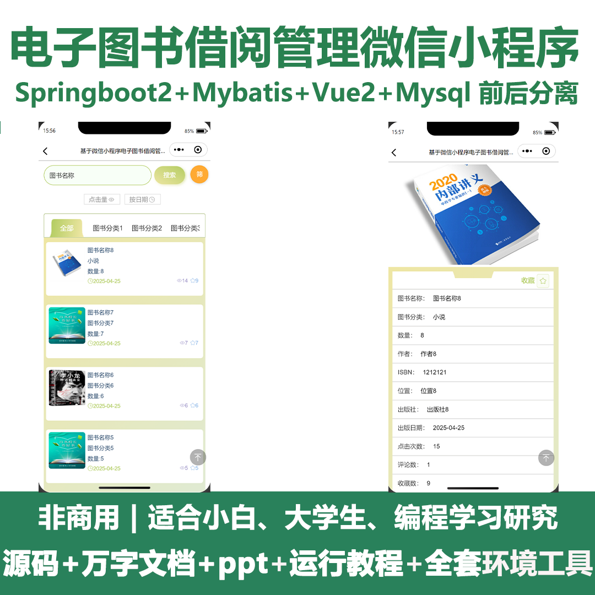
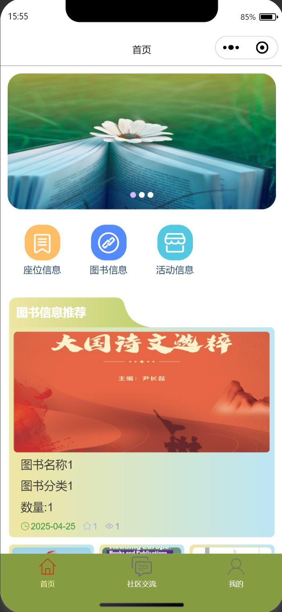
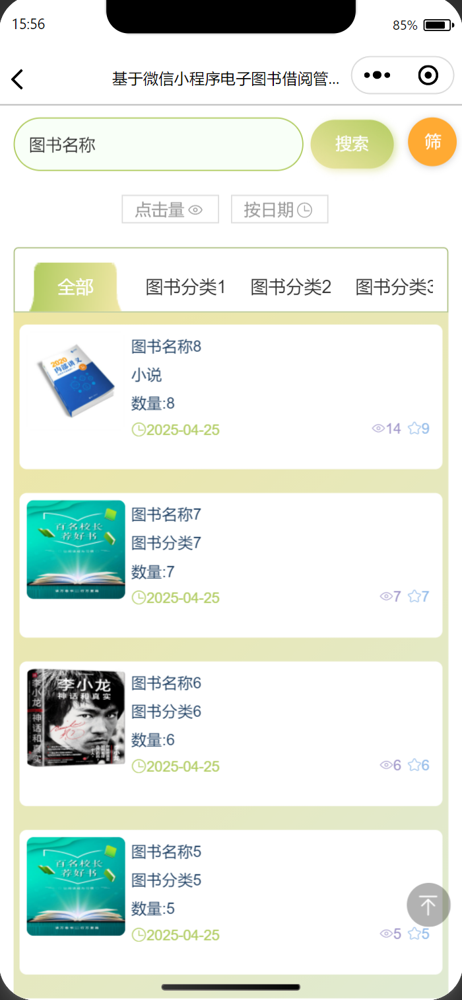
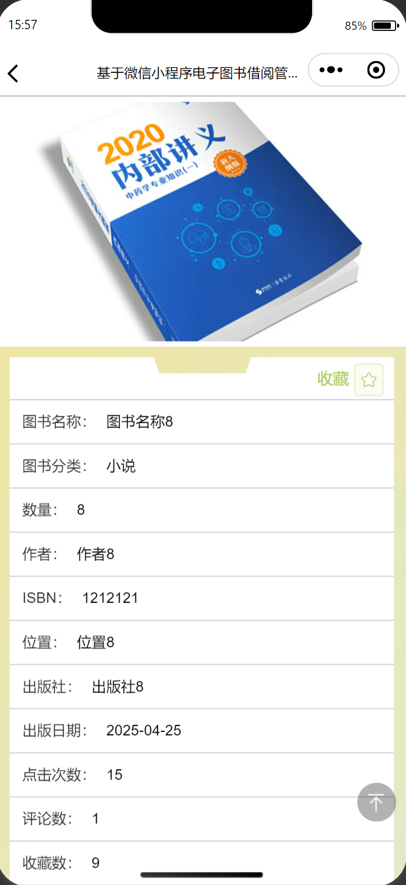
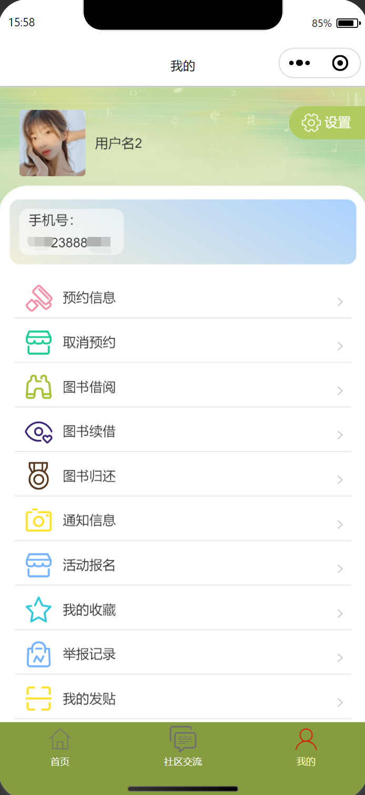
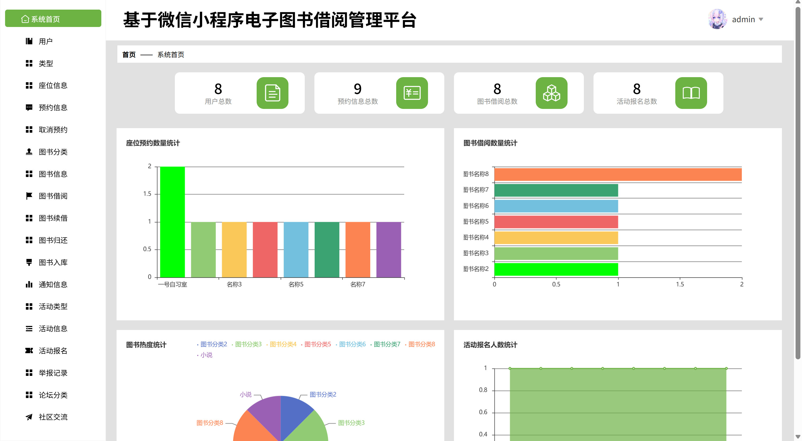
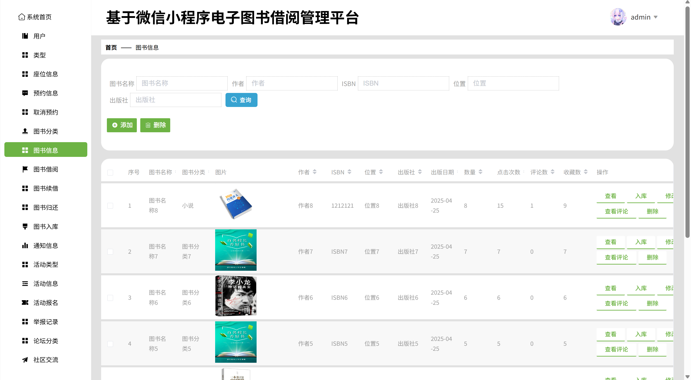
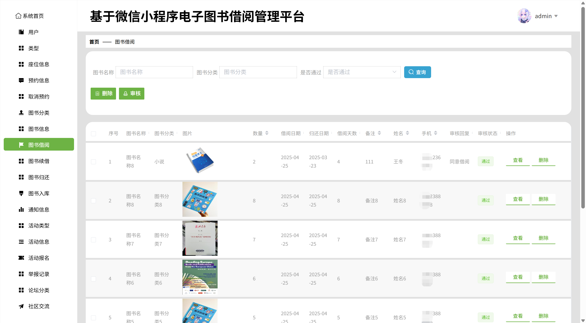
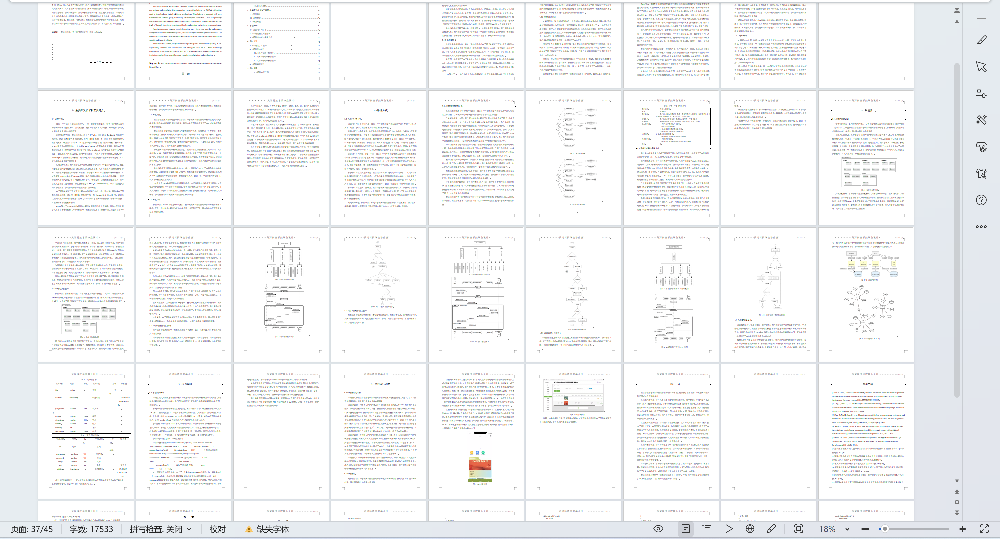

# mpweixinA207D
mpweixinA207D电子图书借阅管理微信小程序+LW+PPT
 
## 源码问题查看主页咨询

### 一、关键词
图书信息，图书借阅，图书续借

### 二、作品包含
源码+数据库+万字设计文档+PPT+全套环境和工具资源+本地部署教程

### 三、项目技术
前端技术： Html、Css、Js、Vue2.0、Element-ui、uniapp
后端技术：Java、SpringBoot2.0、MyBatis

### 四、运行环境（以下版本亲测，其他版本兼容性请自行测试）
开发工具：IDEA/eclipse  + VSCODE + 微信开发者工具 + HBuilder X

数据库：MySQL5.7（最低要5.7版本）

数据库管理工具：Navicat10以上版本

环境配置软件： JDK1.8 + Maven3.6.3

前端Nodejs：14

浏览器：谷歌浏览器

### 五、项目介绍
项目编号：mpweixinA207D

电子图书借阅管理微信小程序可帮助用户在微信端便捷完成电子图书的查询等操作，实现电子图书借阅服务的线上化、高效化。

角色：管理员、用户

管理员：系统首页、用户、类型、座位信息、预约信息、取消预约、图书分类、图书信息、图书借阅、图书续借、图书归还、图书入库、通知信息、活动类型、活动信息、活动报名、举报记录、论坛分类、社区交流、轮播图管理、个人中心。

用户：首页、社区交流、我的、预约信息、取消预约、图书借阅、图书续借、图书归还、通知信息、活动报名、我的收藏、举报记录、我的发贴、修改密码。

### 六、运行截图

